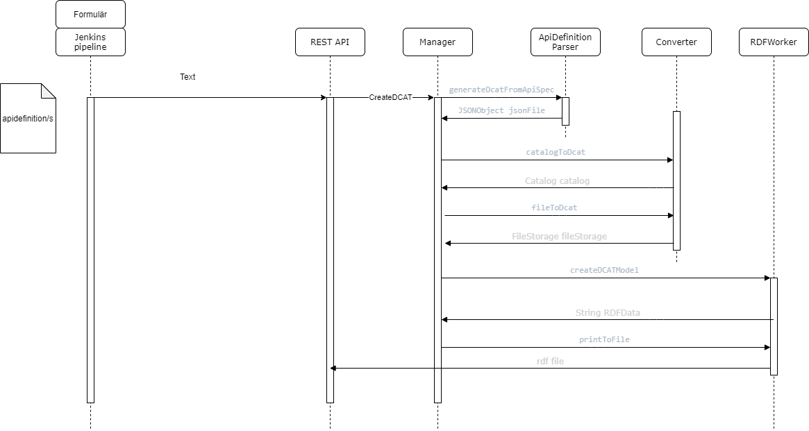

# DCAT-AP-SE Processor
[Sveriges dataportal](https://www.dataportal.se/) synliggör information om datamängder (d.v.s. metadata) där själva datamängderna och åtkomstpunkterna finns publicerade hos olika aktörer.
Detta sker genom att Sveriges dataportal automatiskt inhämtar, ”skördar”, informationen hos publicerande aktör.
En aktör kan vara både från offentlig och privat sektor samt från civilsamhället.

En förutsättning för att dataportalen ska kunna synliggöra bland annat information om datamängder och dess API:er,
är att aktörerna upprättar och publicerar informationen enligt en gemensam och standardiserad metadataspecifikation som är tillgänglig för skördning.
Den specifikationen heter [DCAT-AP-SE](https://docs.dataportal.se/dcat/sv/) och är speciellt framtagen för att passa Sveriges dataportal på grund av den är tillräckligt övergripande för
att passa inhämtning av metadata från olika typer av organisationer och datadomäner.
Det möjliggör en enhetlig beskrivning av datamängder för att förenkla insamling, sökning och presentation av data på Sveriges dataportal.

## Automatiserad process för framställning av metadata
I syfte att hjälpa producenter av metadata, som ska publiceras på dataportalen, har detta verktyg tagits fram för att kunna införlivas i godtycklig CI/CD driven kedja eller köras separat.
Verktyget skapar en metadataspecifikation på RDF format utifrån en api definition alternativt separat metadatafil.

## Format på apidefinitioner
Det finns stöd för OpenAPI, RAML eller separat metadatafil.
* OpenAPI 3.x tillägg av metadata sker via extensions<br>
  Lägg till en extension x-dcat och underliggande metadata hanteras
* RAML1.x tillägg av metadata sker via annotations<br>
  Definiera en annotationType och använd den sedan
* OAS2.x och RAML0.8 tillägg av metadata sker via separat metadatafil på json format

## Arbetsprocess för att publicera api/er på dataportalen
- Skapa konto på dataportalen.se och sätt upp skördningskälla<br>
- Inför metadata i apidefinitionen, eller skapa en separat metadatafil<br>
- Använd verktyget för att generera en RDF fil
- Skörda RDF filen
- Verifiera att skördningen fungerar

### Skapa konto på dataportalen.se
[Skapa konto](https://docs.dataportal.se/accounts/) eller kontrollera [status](https://admin.dataportal.se/status/public) ifall er organisation redan finns upplagd hos dataportalen.se

[Dataportalen docs](https://docs.dataportal.se/) har ingående information om hur skördningen fungerar samt hur en organisation sätter upp sin katalogkälla.

### Införa metadata
För att verktyget ska ges information att generera data behöver api definitionen uppdateras med metadata information.<br>
Repositoryt innehåller [exempelfiler](src/main/resources/metadataExample) som visar hur metadata kan införas i  apidefinition eller i separat metadatafil.<br>
[Attribut som stöds](docs/supported_attributes.md) finns listade med beskrivning.
Utgå från exempelfilerna och ta hjälp av [rekommendationer](https://docs.dataportal.se/dcat/docs/recommendations/) på dataportalen<br>

Det finns exempelfiler som visar hur obligatoriska, rekommenderade och valfria värden kan läggas in.<br>
När apidefinition/erna är uppdaterade med metadata görs de tillgängliga på en publikt nåbar folder, så att den separata pipeline som kör verktyget kan nå dem.

#### Organisation med ett api
Se exempel [enkel fil](src/main/resources/metadataExample/single), där Katalog elementet ligger i samma fil som resterande metadata.

Exempel med obligatoriska och rekommenderade värden.<br>
[RAML](src/main/resources/metadataExample/single/full_example.raml)<br>
[OAS YAML](src/main/resources/metadataExample/single/full_example_oas.yaml)<br>
[OAS JSON](src/main/resources/metadataExample/single/full_example_oas.json)<br>

För API som inte har en definition (code-first) kan producenten tillhandahålla separat metadata på json format<br>
[Separat JSON](src/main/resources/metadataExample/single/full_example.json)<br>

#### Organisation med mer än ett api
Organisation med multipla api att producera RDF från använder en separat catalog.json fil för att hålla samman de ingående api'ernas metadata, se exempel under [multipla filer](src/main/resources/metadataExample/multiple).<br>
För att verktyget ska generera en sammanslagen RDF fil krävs att organisationen skapar filer enligt följande:<br>
catalog.json - beskriver det övergripande katalog elementet och är samma för alla ingående apier.<br>
[catalog.json](src/main/resources/metadataExample/multiple/catalog.json) - Katalog elementet i separat fil på json format<br>

exempel på ingående apidefinitioner innehållande metadata för DCAT-AP-SE<br>
[full_example.raml](src/main/resources/metadataExample/multiple/full_example.raml) - Api A på RAML format<br>
[full_example_oas.yaml](src/main/resources/metadataExample/multiple/full_example_oas.yaml) - Api B på OAS3 yaml format<br>
[full_example_oas.json](src/main/resources/metadataExample/multiple/full_example_oas.json) - Api C på OAS3 json format<br>
[full_example.json](src/main/resources/metadataExample/multiple/full_example.json), Api D, separat metadataspecifikation på json format<br>

## Ingående delar i verktyget
Sekvensdiagram över flödet i verktyget.


### PreprocessorController (REST API)
REST API:n för verktyget, följande två är de som finns att använda:

"/dcat-generation/files/" - Skickar man in directory (dir) som sedan skickas vidare till Managern för hantering. <br>
"/dcat-generation/web/" - Är endpointen från Web-guit som skickar med antingen en sträng med hela apidefinitionen eller en lista med filer som sedan skickas vidare till Managern.

### Manager

Tar emot anrop från REST API't eller formuläret och styr parsning, konvertering och uppskapande av RDF data.

### ApiDefinitionParser

Använder [snakeYaml](https://bitbucket.org/asomov/snakeyaml) för att parsa RAML1.0 och OAS3 yaml strängen, som innehåller apidefinitionen, till JSONObject.

När det gäller OAS3 json format läses den strängen in som JSONObject direkt.

RAML0.8 och/eller OAS2 på json/yaml format stöder inte annotations/extensions, så där får användaren tillgång att lägga metadata i en separat fil på json format, som parsas till JSONObject.

### Converter

Använder MultiValuedMap (Apache Commons) och JSON.simple.

För att konvertera mellan inläst metadata till element på DCAT AP SE format används konverteringsfiler (t.ex. TO_DCAT_OAS.json).<br>
I senare skeden kan man enkelt lägga till nya konverteringsfiler för andra format eller ändra till nyare versioner av befintliga format.

### RDFWorker

Använder RDF4J

Tar emot en lista av Katalog objekt och skapar matchande RDF utifrån det.

## Använda verktyget
Bygg docker image från koden i det här repositoryt, t.ex:
```
docker build --no-cache -t "dcatprocessor" .
```
När container startas finns ett formulär och ett REST API tillgängligt att använda efter behov.

Docker imagen kör Ubuntu 18.04.2 LTS (Bionic Beaver) och installerar Swedish locale, se [dockerfile](dockerfile)

Verktyget kan användas på följande sätt
### Via UI
Starta docker container, öppna browser till http://localhost:8080

Det finns val för att:
* skicka in en sträng med api definitionen
* bifoga en fil med api definitionen
* ange en katalog som håller flera api definitioner

Verktyget levererar resultatet som svar på sidan

### Via anrop till REST gränssnitt
Anropa endpoints med valfritt verktyg. I utveckling har vi använt curl från git bash.

Jenkins pipeline exempel
[Jenkinsfile](docs/jenkinsfile)

## Arbetssätt vid lokal utveckling

### Använda Docker
Kopiera fil från lokal dator till den container man vill köra från

[docker cp](https://docs.docker.com/engine/reference/commandline/cp/)
```
$ docker cp apidef.raml pensive_gates:\opt\apidef.raml
```

Använda docker på dator. Bygg docker image
```
$ mvn clean install
$ docker build --no-cache -t "dcatprocessor" .
```
Starta containern
Från Docker Desktop genom att gå till images och klicka Run samt sätta "Ports/Local port" till 8080
eller från kommandorad
```
$ docker run -p 8080:8080 -d --name dcatprocessor dcatprocessor
```
Kopiera testfiler till container:/apidef<br>
I en riktig miljö hade api producenterna kopierat sina apidefinitioner till en gemensam katalog
och satt sin RDF pipeline att läsa upp dem därifrån.<br>
(docker cp source containername:destination)
```
(docker cp source containername:destination)
$ docker cp apidef.raml hopeful_boyd:/apidef
```

### Köra direkt från jar-filen
För att  köra verktyget direkt från jarfilen öppnar man ett kommandfönster och går till där jar-filen ligger. Sedan kör man:
```
java -jar <jar-file-name>.jar
```
Detta kör igång verktyget lokalt på datorn. 

### Göra anrop till Verktyget
Kör anrop till rest api via git bash, Postman eller annat verktyg<br>

```
Läser filer från /apidef på containern
$ curl http://localhost:8080/api/v1/rdf
```
eller testa med anrop via formulär metoden (Stå i samma katalog som en fil som heter obl_rek_raml.raml eller peka ut nån annan)
```
$ curl -F apispecification= -F create=create -F apitype=apitype.R10 -F apifile=@obl_rek_raml.raml http://localhost:8080/generate/dcat/0
```
Verktyget har även ett enklare GUI man kan använda för att skicka in apispecifikationer genom. GUI:t startas i webläsare genom att gå till (förutsatt att verktyget körs på localhost):

http://localhost:8080/

#Loggning
Exceptions skrivs till container loggen "/opt/logs/dcatprocessor.log".<br>

# Lägga till stöd för nya metadata i verktyget
[Översikt över vad som finns och fungerar enligt DCAT-AP-SE spec](docs/DCATAPSE_completion.md)<br>
[Tillägg i Converter](docs/converter-tutorial.md)<br>
[Tillägg i RDFWorker](docs/rdfworker-tutorial.md)<br>
[specifikationsfil](src/main/resources/dcat_specification.properties)

# Licens
dcat-ap-se-processor är licensierad under [GPL v3](LICENSE)

# Beroenden
snakeYaml [Apache license](docs/Licenser/Apache.txt)<br>
RDF4J [EDL v1.0 license](docs/Licenser/edl-v10.txt)<br>
Spring boot, Spring framework [Apache license](docs/Licenser/Apache.txt)<br>
Project Lombok [MIT license](docs/Licenser/MIT.txt)<br>
commonmark-java [BSD-2 clause simplified license](docs/Licenser/BSD-2.txt)<br>
json-ld-java [BSD-3 clause license](docs/Licenser/BSD-3.txt)<br>
jackson-dataformat-yaml [Apache license](docs/Licenser/Apache.txt)<br>
hibernate-json-org-contributor [BSD-3 clause license](docs/Licenser/BSD-3.txt  )<br>
json-simple [Apache license](docs/Licenser/Apache.txt)<br>
jsoup [MIT license](docs/Licenser/MIT.txt)<br>
commons-collections4 [Apache license](docs/Licenser/Apache.txt)<br>

# Status v0.9
Detta är en första version av verktyget. <br>
Arbetsförmedlingen och Bolagsverket kommer prova mjukvaran skarpt under hösten. <br>
När mjukvaran fungerar för tillräckligt många offentliga organisationer kommer versionen uppdateras till 1.0. <br>
Mjukvaran utvecklas av DIGG och Arbetsförmedlingen.

# Bidra
