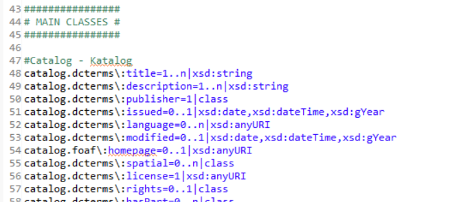
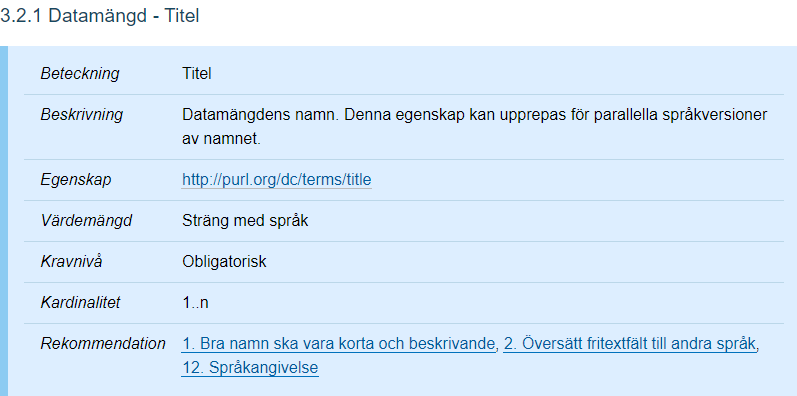
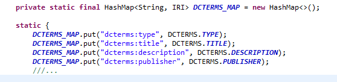
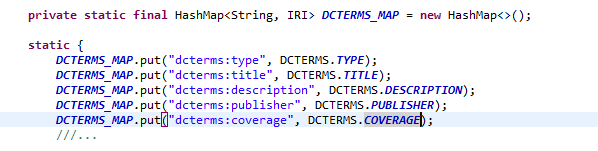
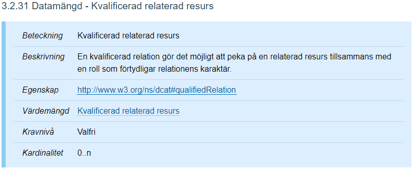
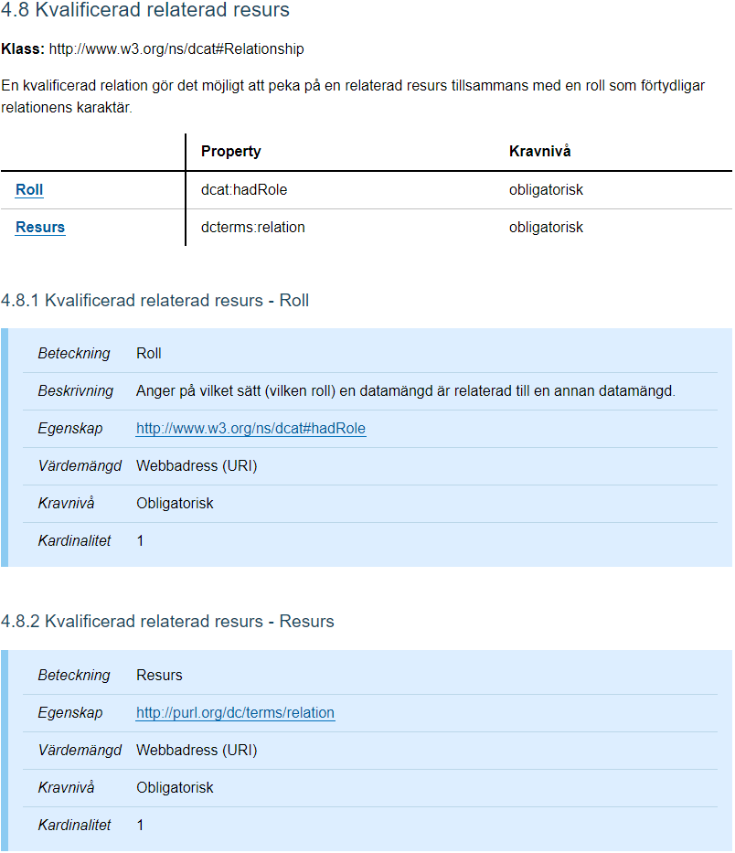
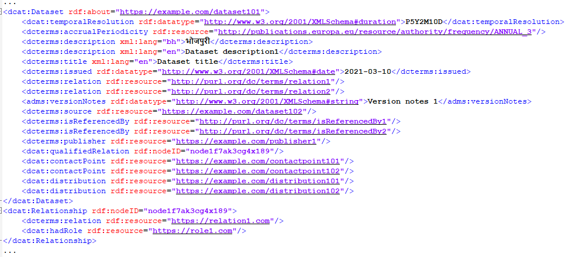

# Tutorial - Lägga till/ändra element i DCAT-fil
Nedan följer ett "kokboksrecept" på hur man ändrar eller lägger till data i den .RDF-fil som genereras av programmet.

För att ändra eller lägga till ett element i .RDF-filen kan det behövas en ändring i programkoden beroende på vilken typ av data som ska läggas till..

RDF-filen generas utifrån DCAT-AP-SE specification som finns på
[Dataportalen DCAT specifikation](https://docs.dataportal.se/dcat/sv/#intro)
I denna tutorial kommer det finnas hänvisningar till denna specifikation och det är bra att studera den om något är oklart.

Element I DCAT-AP-SE kan vara av enkel eller komplex typ. En enkel typ är ett element som bara innehåller ett enkelt värde t.ex en sträng och inte länkar till någon stödjande klass i filen.T.ex [3.2.1 Datamängd - Titel](https://docs.dataportal.se/dcat/sv/#dcat_Dataset-dcterms_title)

En komplex typ är ett element som länkar från en primär klass till en stödjande klass. Den stödjande klassen i sin tur kan innehåll ett eller flera element. Exempelvis [3.2.18 Datamängd - Tidsperiod](https://docs.dataportal.se/dcat/sv/#dcat_Dataset-dcterms_temporal)

För att lägga till en enkel typ behöver man oftast inte ändra i programkoden vilket man måste göra om det är en komplex typ.

## Lägga till en enkel typ
För att lägga till en enkel typ börjar man med säkerställa att typen finns definierad i specifikationsfilen. Specifikationsfilen anger vilka element som RDFWorker kan läsa in från API-specifikationen samt vilka typer ett elementets värde kan ha. Vidare anger specifikationsfilen min/max antal(kardinalitet) av det elementet. Se bild 1.  
  
Bild 1 Utdrag ur specifikationsfilen.

Sökvägen till specifikationsfilen pekas ut av propertyn dcat.specification.prop i propertiesfilen ``application.properties`` 
som finns under
``/src/main/resources/``
Ett exempel på en enkel typ är dcterms:title. Bild 2 visar definitionen som är hämtad från [DCAT-AP-SE version 2.0.0](http://dataportal.se)  


Bild 2 Definition av dcterms:title.

Av beskrivningen kan man se att det är en enkel typ med en sträng som värdemängd. Under egenskap kan man se i vilken namnrymd elementet är definierat

För att denna typ ska kunna läsas in från en API-definition och skrivas in i DCAT-filen behöver den således finnas definierad under varje klass den förekommer. I bild 1 ser vi att den är definierad under klassen Datamängd. Typen är xsd:string och antalet är minst 1 eller däröver. Notera att alla typer, både enkla och komplexa, kan finnas definierad i alla klasser.

Alla typer i DCAT-AP-SE 2.0 finns även definierade internt i programmet. Detta innebär att om standarden utökas med nya typer behöver dessa läggas in internt i programmet. Dessa typer finns definierade i klassen ``VocabularyStringToIRI`` där varje typ är definierad under respektive namnrymd. Se bild 3.
  
Bild 3 Utdrag ur koden i VocabularyStringToIRI.

Bild 4 visar utdrag ur klassen VocabularyStringToIRI. Om det t.ex. skulle komma en ny typ från namnrymden DC-TERMS som heter ``dcterms:coverage`` kan man bara kopiera en av befintliga rader och ändra innehåll enligt bild 4.
  
Bild 4. Uppdatering med ett nytt element i klassen VocabularyStringToIRI.

## Lägga till komplex typ

Att lägga till en komplex typ liknar förfarandet att lägga till en enkel typ men man behöver dessutom göra större ändringar i programkoden. 

För att bäst förklara detta följer nedan ett exempel där vi ska lägga till den komplexa typen `dcat:qualifiedRelation`.

När man tittar i DCAT-AP-SE specifikationen enligt bild 5 ser man att `dcat:qualifiedRelation` har som värdemängd ”Kvalificerad relaterad resurs”.


Bild 5. Kvalificerad relaterad resurs.

Klickar man på den länken ser man att den i sin tur är en klass som är definierad i namnrymden [http://www.w3.org/ns/dcat#Relationship](http://www.w3.org/ns/dcat#Relationship) och har undertyperna `dcat:hadRole` och `dcterms:relation`. Dessa två undertyper i sin tur har bägge värdetypen Webbadress (URI) med kardinalitet 1, dvs obligatoriska. Se bild 6.


Bild 6. Den komplexa klassen Kvalificerad Resurs med två undertyper

Att lägga in en komplex typ i DCAT-filen innebär att den läggs in som en nod med referens till den nod den tilhör. I detta fall Datamängd. Referensen mellan noderna kan vara en URI eller ett nodid som är unikt i den resulterande DCAT-filen.

## Kokboksrecept för att lägga in en komplex typ(dcat:qualifiedRelation)

Det första man gör är att kolla i specifikationsfilen om kvalificerad resurs och dess undertyper finns inlagda under Datamängd. Bilaga 1. En titt i bilagan visar att länken till klassen finns inlagd under datamängd med raden

```
dataset.dcat\:qualifiedRelation=0..n|class

```

Dock är inte klassen som datamängd länkar till definierad. Vi definierar den genom att under ”SUPPORTIVE CLASSES” lägga till raderna

```
#Relationship - Kvalificerad relaterad resurs
relationship.dcat\:hadRole=1|xsd:anyURI
relationship.dcterms\:relation=1|xsd:anyURI
```
Efter relationship deklareras den enkla typen `dcat:hadRole` som har kardinalitet 1 (obligatorisk) och är av typen `xsd:anyURI`. På exakt samma sätt deklareras `dcterms:relation`. Jämför deklarationen med definitionen i bild 6. Dcat och dcterms är prefix för respektive namnrymder och hadRole och relation är elementets namn. Backslash tecknet används för att ”escapa” efterföljande :. Dvs läsa in kolontecknet som ett vanligt tecken. Klassen Properties i Java som läser in filen kommer annars default att tolka kolon som en separator mellan en property och dess värde. Efter = tecknet kommer typens kardinalitet, dvs min/maxgränserna för antalet av denna typ. I detta fall måste det finnas exakt en. Efter kardinaliteten kommer | tecken som används av programmet som intern avgränsare mellan olika propertyvärden. Därefter kommer typen som i bägge dessa fall är `xsd:anyURI`.

Programmet kommer att ge fel vid inläsningen om antalet värden är utanför tillåten kardinalitet eller om värdet inte är en giltig URI

Notera att i datamängd definieras elementet som länkar till relationship med namnrymden [http://www.w3.org/ns/dcat#qualifiedRelation](http://www.w3.org/ns/dcat#qualifiedRelation)
 medan själva relationship klassen definieras med namnrymden [http://www.w3.org/ns/dcat#Relationship](http://www.w3.org/ns/dcat#Relationship) detta kommer att förstås bättre när vi tittar på den resulterande xml-filen.

Notera också att elementet `dcat:qualifiedRelation` i dataset har kardinaliteten 0..n. Alltså ett icke obligatoriskt element.


## Lägga till definitioner i programmets klasser

När definitionen i propertiesfilen är klar är det dags att definiera en del saker i programmets klasser

I klassen `se.ams.dcatprocessor.rdf.DcatClass` (bilaga 2) definieras alla klasser som finns definierade i `dcat_specification.properties`(bilaga 1) för att programmet ska känna till dessa. Här lägger vi till raden 

```
RELATIONSHIP("relationship")
```
 i enumdefinitionerna. Här är det viktigt att namnet är exakt samma som i filen `dcat_specifications.properties`

I klassen `se.ams.dcatprocessor.rdf.VocabularyStringToIRI` (bilaga 3) finns samtliga element med deras prefix och namnrymder definierade och här måste man kolla att varje element finns med.

Vi har ju infört:

```
dcat:qualifiedRelation

dcat:hadRole

dcterms:relation
```

Och här finns alla med förutom dcat:qualifiedRelation. Vi lägger till den i HashMap DCAT_MAP med raden

```
DCAT_MAP.put("dcat:qualifiedRelation", DCAT.QUALIFIED_RELATION);
```

## Skapa koden som lägger till den nya komplexa klassen

I klassen `se.ams.dcatprocessor.rdf.RDFWorker` (bilaga 4)utförs jobbet med att skapa en model och bygga upp den samt skriva ut den på RDF/XML format. Här behöver vi lägga till kod som lägger till relationship som en nod som länkas från Dataset.

I metoden

```
private IRI createDataset(DataSet dataSet, IRI agentIRI)
```
Skapas elementet DataSet och i denna finns sedan tidigare kod som lägger till noder och vi behöver bara kopiera ett av de många anropen till `addNodes()` och byta ut inparametrar. Vi lägger till raderna

```
/*
* Add the Relations...dcat:qualifiedRelation as anonymous nodes
*/
addNodes(dataSetIRI, DCAT.QUALIFIED_RELATION, DCAT.RELATIONSHIP, dataSet.qualifiedRelations);
```

Parametrarna är:

```
dataSetIRI - Föräldranoden
```

```
DCAT.QUALIFIED_RELATION – Elementtypen i Dataset(föräldranoden) som länkar till noden
```

```
DCAT.RELATIONSHIP – Barn-nodens elemttyp relationship)
```

```
dataSet.qualifiedRelations – Lista med objekt där varje objekt innehåller data(dcat:hadRole och dcterms:relation) för en nod.
```

Mer än detta behövs inte. När programmet körs och inkommande data innehåller ett dataset som har en qualified relation så kommer den relevant del av den resulterande .RDF-filen se ut enligt följande(med exempeldata). Se bild 7.


Bild 7. Utdrag av den resulterande rdf-filen.


## Bilaga 1
Konfigurationsfil dcat_specification.properties

```
#
# This file is part of dcat-ap-se-processor.
#
# dcat-ap-se-processor is free software: you can redistribute it and/or modify
# it under the terms of the GNU General Public License as published by
# the Free Software Foundation, either version 3 of the License, or
# (at your option) any later version.
#
# dcat-ap-se-processor is distributed in the hope that it will be useful,
# but WITHOUT ANY WARRANTY; without even the implied warranty of
# MERCHANTABILITY or FITNESS FOR A PARTICULAR PURPOSE.  See the
# GNU General Public License for more details.
#
# You should have received a copy of the GNU General Public License
# along with dcat-ap-se-processor.  If not, see <https://www.gnu.org/licenses/>.
#

#Specifies the cardinality of the elements of DCAT-AP-SE

##
# SYNTAX:
# mainclass.namespace_prefix\:elementname=cardinality|type
#
# Allowed cardinality values:
# 1
# 0..1
# 0..n
# 1..n
# 
# Allowed types:
# xsd:string
# xsd:date
# xsd:dateTime
# xsd:gYear
# xsd:anyURI
# xsd:duration
# xsd:decimal
# xsd:integer
# phoneNumber
# class - Complex type
##

################
# MAIN CLASSES #
################

#Catalog - Katalog
catalog.dcterms\:title=1..n|xsd:string
catalog.dcterms\:description=1..n|xsd:string
catalog.dcterms\:publisher=1|class
catalog.dcterms\:issued=0..1|xsd:date,xsd:dateTime,xsd:gYear
catalog.dcterms\:language=0..n|xsd:anyURI
catalog.dcterms\:modified=0..1|xsd:date,xsd:dateTime,xsd:gYear
catalog.foaf\:homepage=0..1|xsd:anyURI
catalog.dcterms\:spatial=0..n|class
catalog.dcterms\:license=1|xsd:anyURI
catalog.dcterms\:rights=0..1|class
catalog.dcterms\:hasPart=0..n|class
catalog.dcterms\:isPartOf=0..1|class
catalog.dcat\:catalog=0..n|class
catalog.dcat\:themeTaxonomy=0..n|xsd:anyURI
catalog.dcat\:dataset=1..n|class
catalog.dcat\:service=0..n|class

#Agent - Aktör
agent.foaf\:name=1..n|xsd:string
agent.dcterms\:type=0..1|xsd:anyURI
agent.foaf\:homepage=0..n|xsd:anyURI
agent.foaf\:mbox=0..n|xsd:anyURI

#Dataset - Datamängd
dataset.dcterms\:title=1..n|xsd:string
dataset.dcterms\:description=1..n|xsd:string
dataset.dcterms\:publisher=1|class
dataset.dcterms\:creator=0..n|class
dataset.prov\:qualifiedAttribution=0..n|class
dataset.dcat\:contactPoint=0..n|class
dataset.dcat\:keyword=0..n|xsd:string
dataset.dcat\:theme=0..n|xsd:anyURI
dataset.dcterms\:identifier=0..n|xsd:string
dataset.adms\:identifier=0..n|xsd:string
dataset.dcterms\:issued=0..n|xsd:date,xsd:dateTime,xsd:gYear
dataset.dcterms\:modified=0..1|xsd:date,xsd:dateTime,xsd:gYear
dataset.dcterms\:language=0..n|xsd:anyURI
dataset.dcat\:landingPage=0..n|xsd:anyURI
dataset.dcterms\:conformsTo=0..n|class
dataset.dcterms\:spatial=0..n|xsd:anyURI
#dataset.dcterms\:spatial|class Går inte att skilja flera "spatial" åt??
dataset.dcterms\:temporal=0..n|class
dataset.dcat\:temporalResolution=0..1|xsd:duration
dataset.dcat\:spatialResolutionInMeters=0..1|xsd:decimal
dataset.dcterms\:accrualPeriodicity=0..1|xsd:anyURI
dataset.owl\:versionInfo=0..1|xsd:string
dataset.adms\:versionNotes=0..n|xsd:string
dataset.dcterms\:source=0..n|xsd:anyURI
dataset.dcterms\:accessRights=0..1|xsd:anyURI
dataset.schema\:offers=0..n|class
dataset.adms\:identifier=0..n|xsd:string
dataset.dcat\:hasVersion=0..n|xsd:anyURI
dataset.dcat\:isVersionOf=0..n|xsd:anyURI
dataset.dcterms\:isReferencedBy=0..n|xsd:anyURI
dataset.dcterms\:relation=0..n|xsd:anyURI
dataset.dcat\:qualifiedRelation=0..n|class
dataset.foaf\:page=0..1|class
dataset.dcterms\:provenance=0..n|class
dataset.dcat\:distribution=0..n|class
dataset.prov\:qualifiedAttribution=0..n|class

#Organisation - Kontaktuppgift
organization.rdf\:type=1|xsd:string
organization.vcard\:fn=1..n|xsd:string
organization.vcard\:hasEmail=1..n|xsd:anyURI
organization.vcard\:hasTelephone=0..n|class
organization.vcard\:hasAddress=0..n|class
 
#Distribution - Distribution
distribution.dcterms\:title=0..n|xsd:string
distribution.dcterms\:description=0..n|xsd:string
distribution.dcat\:accessURL=1|xsd:anyURI
distribution.dcat\:downloadURL=0..n|xsd:anyURI
# distribution.dcterms\:format kan finnas på flera ställen med värdena Vanliga mediatyper, Geografiska mediatyper och övriga mediatyper.
# Hur ska man kunna skilja dem åt Jo, genom workaround kardinalitet 0..n Det får duga tillsvidare Se sedan
distribution.dcterms\:format=0..n|xsd:string
distribution.dcat\:accessService=0..n|class
distribution.dcat\:temporalResolution=0..1|xsd:duration
distribution.dcat\:spatialResolutionInMeters=0..1|xsd:decimal
distribution.dcat\:byteSize=0..1|xsd:integer
distribution.dcterms\:language=0..n|xsd:anyURI
distribution.dcterms\:issued=0..1|xsd:date,xsd:dateTime,xsd:gYear
distribution.dcterms\:modified=0..1|xsd:date,xsd:dateTime,xsd:gYear
distribution.adms\:status=0..1|xsd:anyURI
distribution.dcatap\:availability=0..1|xsd:anyURI
#distribution.dcterms\:license kan finnas på godtyckligt antal ställen med värdena Creative Commons, Licens övrig.
#Hur skilja dem åt Jo, genom workaround kardinalitet 0..n Se sedan
distribution.dcterms\:license=0..n|xsd:anyURI
distribution.dcterms\:rights=0..1|class
distribution.spdx\:checksum=0..1|class
distribution.foaf\:page=0..n|class
distribution.dcterms\:conformsTo=0..n|class

#Dataservice - Datatjänst
dataservice.dcterms\:title=1..n|xsd:string
dataservice.dcterms\:description=0..n|xsd:string
dataservice.dcat\:endpointURL=1..n|xsd:anyURI
dataservice.dcat\:endpointDescription=0..n|xsd:anyURI
dataservice.dcterms\:publisher=0..n|class
dataservice.dcat\:contactPoint=0..n|class
dataservice.dcterms\:type=0..n|xsd:anyURI
dataservice.dcat\:keyword=0..n|xsd:string
dataservice.dcat\:theme=0..n|xsd:anyURI
dataservice.dcterms\:conformsTo=0..n|class
dataservice.dcat\:servesDataset=0..n|xsd:anyURI
dataservice.dcterms\:license=0..n|class
dataservice.dcterms\:accessRights=0..n|xsd:anyURI
dataservice.dcat\:landingPage=0..n|xsd:anyURI
dataservice.foaf\:page=0..n|class

######################
# SUPPORTIVE CLASSES #
######################

#Document - Dokument
document.dcterms\:title=0..n|xsd:string
document.dcterms\:description=0..n|xsd:string

#License document - Licensdokument
licensedocument.dcterms\:title=0..n|xsd:string
licensedocument.dcterms\:description=0..n|xsd:string

#Standard - Standard
standard.dcterms\:title=0..n|xsd:string
standard.dcterms\:description=0..n|xsd:string

#Location - Geografiskt område. Oklart format så vi tillåter allt
location.dcat\:centroid=0..1|xsd:string
location.dcat\:bbox=0..1|xsd:string
location.locn\:geometry=0..1|xsd:string

#PeriodOfTime - Tidsperiod
periodoftime.dcat\:startDate=0..1|xsd:date,xsd:dateTime,xsd:gYear
periodoftime.dcat\:endDate=0..1|xsd:date,xsd:dateTime,xsd:gYear

#Voice (phone) This needs improvement
voice.vcard\:hasValue=1|phoneNumber

#Address - Adress
address.vcard\:street-address=0..1|xsd:string
address.vcard\:country-name=0..1|xsd:string
address.vcard\:postal-code=0..1|xsd:string
address.vcard\:locality=0..1|xsd:string

#Offer - Avgift
offer.schema\:description=1..n|xsd:string
offer.schema\:mainEntityOfPage=0..1|xsd:anyURI

#Attribution - Övrig aktör
qualifiedattribution.dcat\:hadRole=1|xsd:anyURI
qualifiedattribution.prov\:agent=1|class

#Rightsstatement - Rättighetsförklaring
rightsstatement.odrs\:attributionText=0..n|xsd:string
rightsstatement.odrs\:attributionURL=0..n|xsd:anyURI
rightsstatement.odrs\:copyrightNotice=0..n|xsd:string
rightsstatement.odrs\:copyrightStatement=0..n|class
rightsstatement.odrs\:copyrightYear=0..n|xsd:string
rightsstatement.odrs\:copyrightHolder=0..n|class
rightsstatement.odrs\:jurisdiction=0..n|xsd:anyURI
rightsstatement.odrs\:reuserGuidelines=0..n|xsd:anyURI

#Checksum - Checksumma
checksum.spdx\:checksumValue=1|xsd:string
checksum.spdx\:algorithm=1|xsd:anyURI

#Relationship - Kvalificerad relaterad resurs
relationship.dcat\:hadRole=1|xsd:anyURI
relationship.dcterms\:relation=1|xsd:anyURI
 
#ProvenanceStatement - Ursprung
provenancestatement.dcterms\:description=1..n|xsd:string
```

## Bilaga 2
Klass DCATClass.java

```
/*
 * This file is part of dcat-ap-se-processor.
 *
 * dcat-ap-se-processor is free software: you can redistribute it and/or modify
 * it under the terms of the GNU General Public License as published by
 * the Free Software Foundation, either version 3 of the License, or
 * (at your option) any later version.
 *
 * dcat-ap-se-processor is distributed in the hope that it will be useful,
 * but WITHOUT ANY WARRANTY; without even the implied warranty of
 * MERCHANTABILITY or FITNESS FOR A PARTICULAR PURPOSE.  See the
 * GNU General Public License for more details.
 *
 * You should have received a copy of the GNU General Public License
 * along with dcat-ap-se-processor.  If not, see <https://www.gnu.org/licenses/>.
 */

package se.ams.dcatprocessor.rdf;

/**
 * Enums for the primary and supportive classes in the DCAT-AP-SE Specification
 * 
 * @author nacbr
 */
public enum DcatClass {
		
	CATALOG("catalog"),
	DATASET("dataset"), 
	DISTRIBUTION("distribution"),
	DATASERVICE("dataservice"),
	AGENT("agent"),
	ORGANISATION("organization"),
	DOCUMENT("document"),
	LICENSEDOCUMENT("licensedocument"),
	STANDARD("standard"),
	PERIODOFTIME("periodoftime"),
	LOCATION("location"),
	VOICE("voice"),					//VCARD
	ADDRESS("address"),  			//VCARD
	OFFER("offer"),
	QUALIFIED_ATTRIBUTION("qualifiedattribution"),
	RIGHTS_STATEMENT("rightsstatement"),
	CHECKSUM("checksum"),
	RELATIONSHIP("relationship"),
	PROVENANCE_STATEMENT("provenancestatement");
	
	private String name;
	
	private DcatClass(String name) {
		this.name = name;
	}
	
	public static DcatClass getEnum(String name) {

		if(name == null) {
			return null;
		}
		
		DcatClass[] dcatClasses =  DcatClass.values();
		
		for (DcatClass dcatClass : dcatClasses) {
			
			if(dcatClass.getName().equals(name)) {
				return dcatClass;
			}
		}
		
		return null;
	}
	
	public String getName() {
		return name;
	}

	@Override 
	public String toString() { 
	    return name; 
	}

}

```
## Bilaga 3
Klass VocabularyStringToIRI.java

```
/*
 * This file is part of dcat-ap-se-processor.
 *
 * dcat-ap-se-processor is free software: you can redistribute it and/or modify
 * it under the terms of the GNU General Public License as published by
 * the Free Software Foundation, either version 3 of the License, or
 * (at your option) any later version.
 *
 * dcat-ap-se-processor is distributed in the hope that it will be useful,
 * but WITHOUT ANY WARRANTY; without even the implied warranty of
 * MERCHANTABILITY or FITNESS FOR A PARTICULAR PURPOSE.  See the
 * GNU General Public License for more details.
 *
 * You should have received a copy of the GNU General Public License
 * along with dcat-ap-se-processor.  If not, see <https://www.gnu.org/licenses/>.
 */

package se.ams.dcatprocessor.rdf;

import java.util.HashMap;

import org.eclipse.rdf4j.model.IRI;
import org.eclipse.rdf4j.model.ValueFactory;
import org.eclipse.rdf4j.model.impl.SimpleValueFactory;
import org.eclipse.rdf4j.model.vocabulary.DCAT;
import org.eclipse.rdf4j.model.vocabulary.DCTERMS;
import org.eclipse.rdf4j.model.vocabulary.FOAF;
import org.eclipse.rdf4j.model.vocabulary.LOCN;
import org.eclipse.rdf4j.model.vocabulary.OWL;
import org.eclipse.rdf4j.model.vocabulary.PROV;
import org.eclipse.rdf4j.model.vocabulary.RDF;
import org.eclipse.rdf4j.model.vocabulary.VCARD4;

import se.ams.dcatprocessor.rdf.namespace.ADMS;
import se.ams.dcatprocessor.rdf.namespace.DCATEXT;
import se.ams.dcatprocessor.rdf.namespace.ODRS;
import se.ams.dcatprocessor.rdf.namespace.SCHEMA;
import se.ams.dcatprocessor.rdf.namespace.SPDX;

/**
 * Convenience class for LUT QNAME->IRI
 * 
 * @author nacbr
 *
 */
public class VocabularyStringToIRI {
	
	private static ValueFactory valueFactory = SimpleValueFactory.getInstance(); 
	
	private static final HashMap<String, IRI> RDF_MAP = new HashMap<>();

	static {
		RDF_MAP.put("rdf:type", RDF.TYPE);
	}
	
	
	private static final HashMap<String, IRI> DCAT_MAP = new HashMap<>();

	static {
		DCAT_MAP.put("dcat:catalog", DCAT.CATALOG);
		DCAT_MAP.put("dcat:themeTaxonomy", DCAT.THEME_TAXONOMY);
		DCAT_MAP.put("dcat:dataset", DCAT.DATASET);
		DCAT_MAP.put("dcat:service", DCAT.HAS_SERVICE);
		DCAT_MAP.put("dcat:accessURL", DCAT.ACCESS_URL);
		DCAT_MAP.put("dcat:keyword", DCAT.KEYWORD);
		DCAT_MAP.put("dcat:theme", DCAT.THEME);
		DCAT_MAP.put("dcat:downloadURL", DCAT.DOWNLOAD_URL);
		DCAT_MAP.put("dcat:endpointURL", DCAT.ENDPOINT_URL);
		DCAT_MAP.put("dcat:landingPage", DCAT.LANDING_PAGE);
		DCAT_MAP.put("dcat:servesDataset", DCAT.SERVES_DATASET);
		DCAT_MAP.put("dcat:accessService", DCAT.ACCESS_SERVICE);
		DCAT_MAP.put("dcat:temporalResolution", DCAT.TEMPORAL_RESOLUTION);
		DCAT_MAP.put("dcat:spatialResolutionInMeters", DCAT.SPATIAL_RESOLUTION_IN_METERS);
		DCAT_MAP.put("dcat:byteSize", DCAT.BYTE_SIZE);
		DCAT_MAP.put("dcat:endpointDescription", DCAT.ENDPOINT_DESCRIPTION);
		DCAT_MAP.put("dcat:startDate", DCAT.START_DATE);
		DCAT_MAP.put("dcat:endDate", DCAT.END_DATE);
		DCAT_MAP.put("dcat:centroid", DCAT.CENTROID);
		DCAT_MAP.put("dcat:bbox", DCAT.BBOX);
		DCAT_MAP.put("dcat:hadRole", DCAT.HAD_ROLE);
		DCAT_MAP.put("dcat:qualifiedRelation", DCAT.QUALIFIED_RELATION);
		DCAT_MAP.put("dcat:hasVersion", DCATEXT.HAS_VERSION);
		DCAT_MAP.put("dcat:isVersionOf", DCATEXT.IS_VERSION_OF);
	}
		
	private static final HashMap<String, IRI> DCTERMS_MAP = new HashMap<>();
		
	static {
		DCTERMS_MAP.put("dcterms:type", DCTERMS.TYPE);
		DCTERMS_MAP.put("dcterms:title", DCTERMS.TITLE);
		DCTERMS_MAP.put("dcterms:description", DCTERMS.DESCRIPTION);
		DCTERMS_MAP.put("dcterms:publisher", DCTERMS.PUBLISHER);
		DCTERMS_MAP.put("dcterms:coverage", DCTERMS.COVERAGE);
		///...
		
		
		DCTERMS_MAP.put("dcterms:issued", DCTERMS.ISSUED);
		DCTERMS_MAP.put("dcterms:language", DCTERMS.LANGUAGE);
		DCTERMS_MAP.put("dcterms:modified", DCTERMS.MODIFIED);
		DCTERMS_MAP.put("dcterms:spatial", DCTERMS.SPATIAL);
		DCTERMS_MAP.put("dcterms:license", DCTERMS.LICENSE);
		DCTERMS_MAP.put("dcterms:rights", DCTERMS.RIGHTS);
		DCTERMS_MAP.put("dcterms:hasPart", DCTERMS.HAS_PART);
		DCTERMS_MAP.put("dcterms:isPartOf", DCTERMS.IS_PART_OF);
		DCTERMS_MAP.put("dcterms:format", DCTERMS.FORMAT);
		DCTERMS_MAP.put("dcterms:conformsTo", DCTERMS.CONFORMS_TO);
		DCTERMS_MAP.put("dcterms:accessRights", DCTERMS.ACCESS_RIGHTS);
		DCTERMS_MAP.put("dcterms:creator", DCTERMS.CREATOR);
		DCTERMS_MAP.put("dcterms:identifier", DCTERMS.IDENTIFIER);
		DCTERMS_MAP.put("dcterms:isReferencedBy", DCTERMS.IS_REFERENCED_BY);
		DCTERMS_MAP.put("dcterms:relation", DCTERMS.RELATION);
		DCTERMS_MAP.put("dcterms:accrualPeriodicity", DCTERMS.ACCRUAL_PERIODICITY);
		DCTERMS_MAP.put("dcterms:provenance", DCTERMS.PROVENANCE_STATEMENT);
		DCTERMS_MAP.put("dcterms:source", DCTERMS.SOURCE);
		
	}
	
	private static final HashMap<String, IRI> FOAF_MAP = new HashMap<>();
	
	static {
		FOAF_MAP.put("foaf:name", FOAF.NAME);
		FOAF_MAP.put("foaf:homepage", FOAF.HOMEPAGE);
		FOAF_MAP.put("foaf:mbox", FOAF.MBOX);
		FOAF_MAP.put("foaf:page", FOAF.PAGE);
	}
	
	private static final HashMap<String, IRI> PROV_MAP = new HashMap<>();
	static {
		PROV_MAP.put("prov:qualifiedAttribution", PROV.QUALIFIED_ATTRIBUTION);
		PROV_MAP.put("prov:agent", PROV.AGENT_PROP);
	}

	private static final HashMap<String, IRI> OWL_MAP = new HashMap<>();
	static {
		OWL_MAP.put("owl:versionInfo", OWL.VERSIONINFO);
	}
	
	private static final HashMap<String, IRI> VCARD4_MAP = new HashMap<>();
	static {
		VCARD4_MAP.put("vcard:fn", VCARD4.FN);
		VCARD4_MAP.put("vcard:hasEmail", VCARD4.HAS_EMAIL);
		VCARD4_MAP.put("vcard:hasTelephone", VCARD4.HAS_TELEPHONE);
		VCARD4_MAP.put("vcard:hasAddress", VCARD4.HAS_ADDRESS);
		VCARD4_MAP.put("vcard:street-address", VCARD4.STREET_ADDRESS);
		VCARD4_MAP.put("vcard:postal-code", VCARD4.POSTAL_CODE);
		VCARD4_MAP.put("vcard:locality", VCARD4.LOCALITY);
		VCARD4_MAP.put("vcard:country-name", VCARD4.COUNTRY_NAME);
		VCARD4_MAP.put("vcard:hasValue", VCARD4.HAS_VALUE);
	}
	
	private static final HashMap<String, IRI> DCATAP = new HashMap<>();
	static {
		DCATAP.put("dcatap:availability", valueFactory.createIRI("http://data.europa.eu/r5r/availability", ""));
	}
	
	private static final HashMap<String, IRI> LOCATION = new HashMap<>();
	static {
		LOCATION.put("locn:geometry", LOCN.GEOMETRY);
	}
	
	private static final HashMap<String, IRI> SCHEMA_MAP = new HashMap<>();
	static {
		SCHEMA_MAP.put("schema:description", SCHEMA.DESCRIPTION);
		SCHEMA_MAP.put("schema:mainEntityOfPage", SCHEMA.MAIN_ENTITY_OF_PAGE);
	}
	
	private static final HashMap<String, IRI> ADMS_MAP = new HashMap<>();
	static {
		ADMS_MAP.put("adms:identifier", ADMS.IDENTIFIER);
		ADMS_MAP.put("adms:status", ADMS.STATUS);
		ADMS_MAP.put("adms:versionNotes", ADMS.VERSION_NOTES);
	}
	
	private static final HashMap<String, IRI> ODRS_MAP = new HashMap<>();
	static {
		ODRS_MAP.put("odrs:attributionText", ODRS.ATTRIBUTION_TEXT);
		ODRS_MAP.put("odrs:attributionURL", ODRS.ATTRIBUTION_URL);
		ODRS_MAP.put("odrs:copyrightNotice", ODRS.COPYRIGHT_NOTICE);
		ODRS_MAP.put("odrs:copyrightStatement", ODRS.COPYRIGHT_STATEMENT);
		ODRS_MAP.put("odrs:copyrightYear", ODRS.COPYRIGHT_YEAR);
		ODRS_MAP.put("odrs:copyrightHolder", ODRS.COPYRIGHT_HOLDER);
		ODRS_MAP.put("odrs:jurisdiction", ODRS.JURISDICTION);
		ODRS_MAP.put("odrs:reuserGuidelines", ODRS.REUSER_GUIDELINES);
	}

	private static final HashMap<String, IRI> SPDX_MAP = new HashMap<>();
	static {
		SPDX_MAP.put("spdx:checksum", SPDX.CHECKSUM);		
		SPDX_MAP.put("spdx:checksumValue", SPDX.CHECKSUM_VALUE);
		SPDX_MAP.put("spdx:algorithm", SPDX.ALGORITHM);
		SPDX_MAP.put("spdx:checksumAlgorithm_sha1", SPDX.CHECKSUM_ALGORITHM_SHA1);
	}


	public static IRI getIRI(String qName) {
		if(DCAT_MAP.containsKey(qName)) {
			return DCAT_MAP.get(qName);
		}
		
		if(DCTERMS_MAP.containsKey(qName)) {
			return DCTERMS_MAP.get(qName);
		}
		
		if(FOAF_MAP.containsKey(qName)) {
			return FOAF_MAP.get(qName);
		}
		
		if(PROV_MAP.containsKey(qName)) {
			return PROV_MAP.get(qName);
		}
		
		if(OWL_MAP.containsKey(qName)) {
			return OWL_MAP.get(qName);
		}
		
		if(VCARD4_MAP.containsKey(qName)) {
			return VCARD4_MAP.get(qName);
		}
		
		if(DCATAP.containsKey(qName)) {
			return DCATAP.get(qName);
		}
		
		if(RDF_MAP.containsKey(qName)) {
			return RDF_MAP.get(qName);
		}
		
		if(LOCATION.containsKey(qName)) {
			return LOCATION.get(qName);
		}
		
		if(SCHEMA_MAP.containsKey(qName)) {
			return SCHEMA_MAP.get(qName);
		}
		
		if(ADMS_MAP.containsKey(qName)) {
			return ADMS_MAP.get(qName);
		}
		
		if(ODRS_MAP.containsKey(qName)) {
			return ODRS_MAP.get(qName);
		}
		
		if(SPDX_MAP.containsKey(qName)) {
			return SPDX_MAP.get(qName);
		}
		
		return null;
	}

}
```
## Bilaga 4
Klass RDFWorker.java

```
/*
 * This file is part of dcat-ap-se-processor.
 *
 * dcat-ap-se-processor is free software: you can redistribute it and/or modify
 * it under the terms of the GNU General Public License as published by
 * the Free Software Foundation, either version 3 of the License, or
 * (at your option) any later version.
 *
 * dcat-ap-se-processor is distributed in the hope that it will be useful,
 * but WITHOUT ANY WARRANTY; without even the implied warranty of
 * MERCHANTABILITY or FITNESS FOR A PARTICULAR PURPOSE.  See the
 * GNU General Public License for more details.
 *
 * You should have received a copy of the GNU General Public License
 * along with dcat-ap-se-processor.  If not, see <https://www.gnu.org/licenses/>.
 */

package se.ams.dcatprocessor.rdf;

import java.io.ByteArrayOutputStream;
import java.io.IOException;
import java.math.BigDecimal;
import java.nio.charset.Charset;
import java.time.Period;
import java.time.temporal.TemporalAmount;
import java.util.ArrayList;
import java.util.Collection;
import java.util.List;
import java.util.Set;
import java.util.regex.Pattern;

import org.apache.commons.collections4.MultiValuedMap;
import org.eclipse.rdf4j.model.IRI;
import org.eclipse.rdf4j.model.Literal;
import org.eclipse.rdf4j.model.Model;
import org.eclipse.rdf4j.model.Resource;
import org.eclipse.rdf4j.model.ValueFactory;
import org.eclipse.rdf4j.model.impl.LinkedHashModel;
import org.eclipse.rdf4j.model.impl.SimpleNamespace;
import org.eclipse.rdf4j.model.impl.SimpleValueFactory;
import org.eclipse.rdf4j.model.vocabulary.DCAT;
import org.eclipse.rdf4j.model.vocabulary.DCTERMS;
import org.eclipse.rdf4j.model.vocabulary.FOAF;
import org.eclipse.rdf4j.model.vocabulary.LOCN;
import org.eclipse.rdf4j.model.vocabulary.PROV;
import org.eclipse.rdf4j.model.vocabulary.RDF;
import org.eclipse.rdf4j.model.vocabulary.VCARD4;
import org.eclipse.rdf4j.model.vocabulary.XSD;
import org.eclipse.rdf4j.rio.RDFHandler;
import org.eclipse.rdf4j.rio.Rio;
import org.eclipse.rdf4j.rio.helpers.BufferedGroupingRDFHandler;
import org.eclipse.rdf4j.rio.rdfxml.util.RDFXMLPrettyWriter;
import org.slf4j.Logger;
import org.slf4j.LoggerFactory;
import org.springframework.lang.NonNull;

import se.ams.dcatprocessor.models.Catalog;
import se.ams.dcatprocessor.models.DataClass;
import se.ams.dcatprocessor.models.DataService;
import se.ams.dcatprocessor.models.DataSet;
import se.ams.dcatprocessor.models.Distribution;
import se.ams.dcatprocessor.models.FileStorage;
import se.ams.dcatprocessor.models.Organization;
import se.ams.dcatprocessor.rdf.namespace.ADMS;
import se.ams.dcatprocessor.rdf.namespace.ODRS;
import se.ams.dcatprocessor.rdf.namespace.SCHEMA;
import se.ams.dcatprocessor.rdf.namespace.SPDX;
import se.ams.dcatprocessor.rdf.validate.CardinalityValidator;
import se.ams.dcatprocessor.rdf.validate.InputType;
import se.ams.dcatprocessor.rdf.validate.MultipleURIValidator;
import se.ams.dcatprocessor.rdf.validate.SingleInputValidator;
import se.ams.dcatprocessor.rdf.validate.ValidationErrorStorage;
import se.ams.dcatprocessor.util.Util;

//TODO:

//Datamängd - Dokumentation
//Distribution - Dokumentation
//Datatjänst - Dokumentation

//Datatjänst - Uppfyller
//Distribution - Länkade scheman


/**
 * @see <a href="https://docs.dataportal.se/dcat/sv/#intro">https://docs.dataportal.se/dcat/sv/#intro</a>
 * @author nacbr
 *
 */
public class RDFWorker {
	private static Logger logger = LoggerFactory.getLogger(RDFWorker.class);

	private Model model;
	
	/**
	 * Holds the file that is presently being processed
	 */
	private String currentFileName;

	private MultipleURIValidator multipleURIValidator;
	
	public RDFWorker() {
		multipleURIValidator = new MultipleURIValidator();
	}

	/**
	 * 
	 * Creates a RDF-file that according to DCAT-AP-SE format based on the data in Catalog and the list of
	 * FileStorage objects. The elements created from the data in the FileStorage objects are appended to
	 * the Catalog
	 * 
	 * @see <a href="https://docs.dataportal.se/dcat/sv/#intro">https://docs.dataportal.se/dcat/sv/#intro</a>
	 * 
	 * @param catalog - Contains the data for Catalog
	 * @param fileStorages - 	The list of FileStorage objects where each FileStorage object contains 
	 * 							data from one API-specification file
	 * @return The resulting RDF-file as an XML-string
	 * @throws DcatException - If there is an error processing data or creating the file
	 * @throws IOException - If there is an error processing data or creating the file
	 */
	public String createDcatFile(Catalog catalog, List<FileStorage> fileStorages) throws DcatException, IOException {

		createModel();
		
		ValidationErrorStorage validationErrorStorage = ValidationErrorStorage.getInstance();
		
		/**
		 * The Catalog data does not come from a file with a name we can access 
		 * so we use a generic name as an identifier for possible errors in this input data
		 */
		SingleInputValidator.getInstance().setCurrentFileName(catalog.fileName);
		CardinalityValidator.getInstance().setCurrentFileName(catalog.fileName);
		multipleURIValidator.setCurrentFileName(catalog.fileName);

		/**
		 * Returnparmeter from createCatalog is a list with IRI where
		 * IRI[0] = Catalog
		 * IRI[1] = Agent
		 */
		IRI[] catalogAndAgent = createCatalog(catalog);
		
		model.add(catalogAndAgent[0], RDF.TYPE, DCAT.CATALOG);
		
		model.add(catalogAndAgent[0], DCTERMS.PUBLISHER, catalogAndAgent[1]);
		
		for (FileStorage fileStorage : fileStorages) {
			
			currentFileName = fileStorage.fileName;
			
			/**
			 * Save validation errors under the correct filename
			 */
			SingleInputValidator.getInstance().setCurrentFileName(currentFileName);
			CardinalityValidator.getInstance().setCurrentFileName(currentFileName);
			multipleURIValidator.setCurrentFileName(currentFileName);
			
			/*
			 * Create DataSets and add them to the model and add the reference from Catalog
			 * to DataSet
			 */
			
			Util.checkNotNull(fileStorage.dcat_dataset, UNABLE_CREATE_MISSING_VALUES.replaceAll("X", "Catalog.dcat_dataset"));
			
			for (DataSet dataSet : fileStorage.dcat_dataset) {	
				IRI iriDataSet = createDataset(dataSet, catalogAndAgent[1]);
				model.add(catalogAndAgent[0], DCAT.HAS_DATASET, iriDataSet);
			}
			
			
			/*
			 * Create DataService and add them to the model and then 
			 * add the reference from Catalog to DataServices
			 */
			for (DataService dataService : fileStorage.dataService) {
				IRI dataServiceIRI = createDataService(dataService);
				model.add(catalogAndAgent[0], DCAT.DATA_SERVICE, dataServiceIRI);
			}
			
			
		}
		
		multipleURIValidator.validate();
		
		if(validationErrorStorage.hasValidationErrors()) {
			DcatException dcatException = new DcatException("Error creating DCAT-AP-SE due to validationerrors. See enclosed list");
			dcatException.setValidationResults(validationErrorStorage.getValidationErrors());
			throw dcatException;
		} else {
			return printModel(model);
		}
		
	}
	
	private void createModel() {
		model = new LinkedHashModel();
		//Add namespaces
		model.setNamespace(DCAT.NS);
		model.setNamespace(DCTERMS.NS);
		model.setNamespace(FOAF.NS);
		model.setNamespace(VCARD4.NS);
		model.setNamespace(RDF.NS);
		model.setNamespace(XSD.NS);
		model.setNamespace(LOCN.NS);
		model.setNamespace(SCHEMA.NS);
		model.setNamespace(PROV.NS);
		model.setNamespace(ADMS.NS);
		model.setNamespace(ODRS.NS);
		model.setNamespace(SPDX.NS);
		model.setNamespace(new SimpleNamespace("dcatap", "http://data.europa.eu/r5r#"));
	}

	/**
	 * Generates a RDF/XML string from the model
	 * 
	 * @return The generated string
	 */
	private String printModel(Model model) {
		ByteArrayOutputStream bos = new ByteArrayOutputStream();
		Rio.write(model, new BufferedGroupingRDFHandler((RDFHandler) new RDFXMLPrettyWriter(bos)));
		// Rio.write(model, new RDFXMLPrettyWriter(bos)); //Not so pretty output with this printer
		return bos.toString(Charset.forName("UTF-8"));
	}


	/*
	 * Predefined errormessage
	 */
	private final String UNABLE_CREATE_MISSING_VALUES = this.getClass() + " : Unable to create DCAT. Reason: X is a mandatory but is missing"; 


	/**
	 * Creates a catalog from data contained in the catalog object
	 * @see <a href="http://www.w3.org/ns/dcat#Catalog">Catalog</a>
	 * @param catalog - Containing the data
	 * @return IRI[] - A list of IRI with two objects [0] Catalog(IRI) [1] Agent(IRI)
	 * @throws DcatException - If there is an error during processing
	 * @throws IOException - If there is an IOException
	 */
	private IRI[] createCatalog(Catalog catalog) throws DcatException, IOException{
	
		IRI[] catalogAndAgent = new IRI[2];
		
		Util.checkNotNull(catalog, UNABLE_CREATE_MISSING_VALUES.replaceAll("X", "Catalog"));
		
		/**
		 * Special check that subject exist and is valid URI because this is a stopping error
		 */
		checkSubject("Catalog.about", catalog.about); 
		
		Util.checkNotNull(catalog.publisher, UNABLE_CREATE_MISSING_VALUES.replaceAll("X", "Catalog.publisher"));
		
		/**
		 * Check that the keys for inputvalues:
		 * 1. Are defined in the specification
		 * 2. Occur within the range allowed in the specification
		 */
		List<String> checkedElsewhere = List.of("dcat:dataset", "dcterms:publisher"); //Items that will not be checked now
		CardinalityValidator.getInstance().validate(DcatClass.CATALOG, catalog.dcData, checkedElsewhere);
		
		IRI catalogIRI = createIri(catalog.about);
		
		catalogAndAgent[0] = catalogIRI;
		
		IRI agentIRI = createAgent(catalog.publisher);
		catalogAndAgent[1] = agentIRI;
		
		addToModel(model, catalogIRI, catalog.dcData);
				
		/*
		 * Add the Rights...if it exist
		 */
		addRights(catalogIRI, catalog.rights);
		
		/*
		 * Add locations as anonymous nodes
		 */
		addNodes(catalogIRI, DCTERMS.SPATIAL, DCTERMS.LOCATION, catalog.spatial);
		
		return catalogAndAgent;
	}
	
	/**
	 * Creates a Agent with all its data @see <a href="http://xmlns.com/foaf/0.1/Agent">Agent</a>
	 * @param agent - The object containing the data for Agent
	 * @return - The Agent
	 */
	private IRI createAgent(DataClass agent) {
		/**
		 * Special check that subject exist and is valid URI because this is a stopping error
		 */
		checkSubject("Agent.about", agent.about); 
		
		/**
		 * Check that the keys for inputvalues:
		 * 1. Are defined in the specification
		 * 2. Occur within the range allowed in the specification
		 */
		CardinalityValidator.getInstance().validate(DcatClass.AGENT, agent.dcData, List.of());

		IRI agentIRI = SimpleValueFactory.getInstance().createIRI(agent.about);

		model.add(agentIRI, RDF.TYPE, FOAF.AGENT);

		addToModel(model, agentIRI, agent.dcData);

		return agentIRI;
	}

	/**
	 * Creates a Dataset with all its data and creates a link from
	 * the dataset to the Publisher
	 * @see <a href="http://www.w3.org/ns/dcat#Dataset">Dataset</a>
	 * @param dataSet The object containing the data for Dataset
	 * @param agentIRI - The Agent to link to
	 * @return - The Dataset
	 */
	private IRI createDataset(DataSet dataSet, IRI agentIRI) throws IOException {
		/**
		 * Special check that subject exist and is valid URI because this is a stopping error
		 */
		checkSubject("DataSet.about", dataSet.about);
				
		/**
		 * Check that the keys for inputvalues:
		 * 1. Are defined in the specification
		 * 2. Occur within the range allowed in the specification
		 */
		List<String> checkedElsewhere = List.of("dcterms:publisher", "dcterms:creator"); //Items that will not be checked now
		CardinalityValidator.getInstance().validate(DcatClass.DATASET, dataSet.dcData, checkedElsewhere);
		
	
		IRI dataSetIRI =  createIri(dataSet.about);
		model.add(dataSetIRI, RDF.TYPE, DCAT.DATASET);
		
		//Add all values to dataset
		addToModel(model, dataSetIRI, dataSet.dcData);

		//Add the reference to the external element publisher
		model.add(dataSetIRI, DCTERMS.PUBLISHER, agentIRI);

		/*
		 * Add creator
		 */
		if ((dataSet.creator != null) && !dataSet.creator.equals(null)) {
			IRI CreatorIRI = createAgent(dataSet.creator);
			model.add(dataSetIRI, DCTERMS.CREATOR, CreatorIRI);
		}

		
		/*
		 * Add locations as anonymous nodes
		 */
		addNodes(dataSetIRI, DCTERMS.SPATIAL, DCTERMS.LOCATION, dataSet.spatial);
		
		/*
		 * Add temporals as anonymous nodes
		 */
		addNodes(dataSetIRI, DCTERMS.TEMPORAL, DCTERMS.PERIOD_OF_TIME, dataSet.temporals);
		
		/*
		 * Add offers as anonymous nodes
		 */
		addNodes(dataSetIRI, SCHEMA.OFFERS, SCHEMA.OFFER, dataSet.offers);		
	
		/*
		 * Add the Uppfyller...conformsTo as anonymous nodes
		 */
		addNodes(dataSetIRI, DCTERMS.CONFORMS_TO, DCTERMS.STANDARD, dataSet.conformsTo);
		
		/*
		 * Add the Documentation...foaf:page as anonymous nodes
		 */
		addNodes(dataSetIRI, FOAF.PAGE, FOAF.DOCUMENT, dataSet.documents);
		
		/*
		 * Add the Relations...dcat:qualifiedRelation as anonymous nodes
		 */
		addNodes(dataSetIRI, DCAT.QUALIFIED_RELATION, DCAT.RELATIONSHIP, dataSet.qualifiedRelations);
		
		/*
		 * Add Provenance...dcterms:provenance as anonymous nodes
		 */
		addNodes(dataSetIRI, DCTERMS.PROVENANCE_STATEMENT, DCTERMS.PROVENANCE, dataSet.provenances);
		
		/*
		 * Add the Övrig aktör ...prov:qualifiedAttribution as anonymous nodes
		 * Different from other anonymous nodes since it has an Agent(complex type)
		 */
		for (DataClass dataClass : dataSet.otherAgents) {
			List<Resource> anonymousNodesList = addNodes(dataSetIRI, PROV.QUALIFIED_ATTRIBUTION, PROV.ATTRIBUTION, List.of(dataClass));
			
			IRI tmpAgentIRI = createAgent(dataClass.agent);
			
			model.add(anonymousNodesList.get(0), PROV.AGENT_PROP, tmpAgentIRI);
		}
		
		
		/*
		 * Create ContactPoints and add them to the model and then 
		 * add the reference from DataSet to ContactPoints
		 */
		for (Organization org : dataSet.organizations) {
			IRI organizationIRI = createOrganization(org);
			model.add(dataSetIRI, DCAT.CONTACT_POINT, organizationIRI);
		}

		/*
		 * Create Distributions and add them to the model and then 
		 * add the reference from DataSet to Distributions
		 */
		for (Distribution distribution : dataSet.dcat_distribution) {
			IRI distributionIRI = createDistribution(distribution);
			model.add(dataSetIRI, DCAT.HAS_DISTRIBUTION, distributionIRI);
		}

		return dataSetIRI;
	}
	
	private void addRights(@NonNull IRI parentIRI, @NonNull DataClass rights) {
		
		if(Util.isNullOrEmpty(rights)) {
			return;
		}
		
		/**
		 * Create the rights node as anonymous nodes with reference to parent node
		 */
		List<Resource> rightsNodesList = addNodes(parentIRI, DCTERMS.RIGHTS, ODRS.RIGHTS_STATEMENT, List.of(rights));
		
		/**
		 * Create the license documents as anonymous nodes with reference to the Rights node
		 */
		addNodes(rightsNodesList.get(0), ODRS.COPYRIGHT_STATEMENT, DCTERMS.LICENSE_DOCUMENT, rights.licenseDocuments);
		
		/*
		 * Create Agents(publishers) and add them to the model and 
		 * then add the reference from DataService to Agents(publishers) 
		 */
		for (DataClass agent : rights.agents) {
			IRI agentIRI = createAgent(agent);
			model.add(rightsNodesList.get(0), ODRS.COPYRIGHT_HOLDER, agentIRI);
		}

	}
			
	/**
	 * Creates a Distribution with all its data
	 * @see <a href="http://www.w3.org/ns/dcat#Distribution">Distribution</a>
	 * @param distribution The object containing the data for Distribution
	 * @return The Distribution
	 */
	private IRI createDistribution(Distribution distribution) throws IOException {
		/**
		 * Special check that subject exist and is valid URI because this is a stopping error
		 */
		checkSubject("Distribution.about", distribution.about);

		/**
		 * Check that the keys for inputvalues:
		 * 1. Are defined in the specification
		 * 2. Occur within the range allowed in the specification
		 */
		List<String> checkedElsewhere = List.of("dcat:accessService"); //Items that will not be checked now
		CardinalityValidator.getInstance().validate(DcatClass.DISTRIBUTION, distribution.dcData, checkedElsewhere);
		
		IRI distributionIRI = createIri(distribution.about);
		model.add(distributionIRI, RDF.TYPE, DCAT.DISTRIBUTION);
		
		//Add all values to Organization
		addToModel(model, distributionIRI, distribution.dcData);
		
		/*
		 * Add the Uppfyller...conformsTo as anonymous nodes
		 */
		addNodes(distributionIRI, DCTERMS.CONFORMS_TO, DCTERMS.STANDARD, distribution.conformsTo);

		/*
		 * Add the licensedocuments as anonymous nodes
		 */
		addNodes(distributionIRI, DCTERMS.LICENSE, DCTERMS.LICENSE_DOCUMENT, distribution.licenseDocuments);
		
		for (DataClass dataClass : distribution.licenseDocuments) {
			
		}
		
		/*
		 * Add the Documentation...foaf:page as anonymous nodes
		 */
		addNodes(distributionIRI, FOAF.PAGE, FOAF.DOCUMENT, distribution.documents);
		
		/*
		 * Add the Rights...if it exist
		 */
		addRights(distributionIRI, distribution.rights);
		
		/*
		 * Add CheckSum...if it exist
		 */
		if(Util.isNotNullOrEmpty(distribution.checksum)) {
			addNodes(distributionIRI, SPDX.CHECKSUM, SPDX.CHECKSUM, List.of(distribution.checksum));
		}
		
		/*
		 * Create DataServices and add them to the model and 
		 * then add the reference from Distribution to DataServices 
		 */
		for (DataService dataService : distribution.dataServices) {
			IRI dataServiceIRI = createDataService(dataService);
			model.add(distributionIRI, DCAT.DATA_SERVICE, dataServiceIRI);
		}
				
		return distributionIRI;
	}
	
	/**
	 * Creates a Dataservice with all its data
	 * @see <a href="http://www.w3.org/ns/dcat#DataService">DataService</a>
	 * @param dataService - The object containing the data for dataService
	 * @return DataService - The Dataservice
	 */
	private IRI createDataService(DataService dataService) throws IOException {
		/**
		 * Special check that subject exist and is valid URI because this is a stopping error
		 */		
		checkSubject("Dataservice.about", dataService.about);
				
		/**
		 * Check that the keys for inputvalues:
		 * 1. Are defined in the specification
		 * 2. Occur within the range allowed in the specification
		 */
		List<String> checkedElsewhere = List.of("dcterms:publisher", "dcat:contactPoint"); //Items that will not be checked now
		CardinalityValidator.getInstance().validate(DcatClass.DATASERVICE, dataService.dcData, checkedElsewhere);
		
		IRI dataServiceIRI = createIri(dataService.about);
		model.add(dataServiceIRI, RDF.TYPE, DCAT.DATA_SERVICE);
		
		//Add all simple values to Dataservice
		addToModel(model, dataServiceIRI, dataService.dcData);
		
		/*
		 * Add the Uppfyller...conformsTo as anonymous nodes
		 */
		addNodes(dataServiceIRI, DCTERMS.CONFORMS_TO, DCTERMS.STANDARD, dataService.conformsTo);
		
		/*
		 * Add the licensedocuments as anonymous nodes
		 */
		addNodes(dataServiceIRI, DCTERMS.LICENSE, DCTERMS.LICENSE_DOCUMENT, dataService.licenseDocuments);
		
		/*
		 * Add the Documentation...foaf:page as anonymous nodes
		 */
		addNodes(dataServiceIRI, FOAF.PAGE, FOAF.DOCUMENT, dataService.documents);
		
		/*
		 * Create Agents(publishers) and add them to the model and 
		 * then add the reference from DataService to Agents(publishers) 
		 */
		for (DataClass agent : dataService.agents) {
			IRI agentIRI = createAgent(agent);
			model.add(dataServiceIRI, DCTERMS.PUBLISHER, agentIRI);
		}

		/*
		 * Create Organizations and add them to the model and 
		 * then add the reference from DataService to Organizations 
		 */
		for (Organization organization : dataService.organizations) {
			IRI organizationIRI = createOrganization(organization);
			model.add(dataServiceIRI, DCAT.CONTACT_POINT, organizationIRI);
		}
		
		return dataServiceIRI;
	}
	
	/**
	 * Creates a ContactPoint with all its data
	 * @see <a href="http://www.w3.org/ns/dcat#Organization">Organization</a>
	 * @param org - The object containing the data for Organization
	 * @return - The Organization
	 */
	private IRI createOrganization(Organization org) throws IOException {
		/**
		 * Special check that subject exist and is valid URI because this is a stopping error
		 */
		checkSubject("ContactPoint.about", org.about);
		
		/**
		 * Check that the keys for inputvalues:
		 * 1. Are defined in the specification
		 * 2. Occur within the range allowed in the specification
		 */
		List<String> checkedElsewhere = List.of("vcard:hasTelephone", "vcard:hasAddress"); //Items that will not be checked now
		CardinalityValidator.getInstance().validate(DcatClass.ORGANISATION, org.dcData, checkedElsewhere);
				
		IRI organizationIRI = createIri(org.about);
		model.add(organizationIRI, RDF.TYPE, VCARD4.ORGANIZATION);

		//Add all simple values to Organization
		addToModel(model, organizationIRI, org.dcData);

		/*
		 * Add addresses as anonymous nodes
		 */
		addNodes(organizationIRI, VCARD4.HAS_ADDRESS, VCARD4.ADDRESS, org.adress);
		
		/*
		 * Add phones as anonymous nodes
		 */
		addNodes(organizationIRI, VCARD4.HAS_TELEPHONE, VCARD4.VOICE, org.phone);
		
		return organizationIRI;
	}
	
	
	/**
	 * Creates a node with an anonymous link or an URI depending on if an URI-link is submitted
	 * @param parentIRI - Reference to parent node
	 * @param parentIRINodeTypeRef - Parent node reference type
	 * @param nodeType - Type of node
	 * @param dataClasses - Placeholder for data to be added to this node
	 * @return The list of created BNodes
	 */
	private List<Resource> addNodes(@NonNull Resource parentIRI, @NonNull IRI parentIRINodeTypeRef, @NonNull IRI nodeType, @NonNull List<DataClass> dataClasses) {
		List<Resource> resources = new ArrayList<>();
		
		ValueFactory valueFactory = SimpleValueFactory.getInstance();
		
		for (DataClass dataClass : dataClasses) {
			Resource resource;
			if(Util.isNullOrEmpty(dataClass.about)) {
				resource = valueFactory.createBNode();			//Create an anonymous node	
			} else {
				/**
				 * Special check that subject exist and is valid URI because this is a stopping error
				 */
				checkSubject(parentIRINodeTypeRef.getLocalName(), dataClass.about);
				resource = createIri(dataClass.about);			//Otherwise create a node with an URI as reference
			}
			
			model.add(parentIRI, parentIRINodeTypeRef, resource);	//Add reference from parent IRI
			model.add(resource, RDF.TYPE, nodeType);
			addDataToNode(resource, dataClass.dcData);	//Add data to node
			
			resources.add(resource);
		}
		
		return resources;
	}
	
	/**
	 * Adds the values in valueMap to the node
	 * @param resource - The node to add value to
	 * @param valueMap - Containing the data to be added
	 */
	private void addDataToNode(Resource resource, MultiValuedMap<String, String> valueMap) {
		
		ValueFactory valueFactory = SimpleValueFactory.getInstance();
		
		Set<String> keySet = valueMap.keySet();
		
		for (String key : keySet) {
		
			IRI iri = VocabularyStringToIRI.getIRI(key);
			
			if (Util.isNotNullOrEmpty(iri)) {
			
				Collection<String> values = valueMap.get(key);
				
				for (String value : values) {
					
					SingleInputValidator.getInstance().validateData(key, value);
				
					if (Util.isURI(value) ) { // Check if its an URI and create a resource
						model.add(resource, iri, valueFactory.createIRI(value));
					} else if (isLanguageValue(value)) { // Check if it's a language specific string, Ex en:Some text in english
						String[] split = value.split(SUN);
						model.add(resource, iri, valueFactory.createLiteral(split[1], split[0]));
					} else {
						Literal dateLiteral = getDateValue(value);
						if (dateLiteral != null) { 					//Datevalue
							model.add(resource, iri, dateLiteral);
						} else if(isPhoneValue(key)) {	//Phone value...needs to handled separately from a URI
							model.add(resource, iri, valueFactory.createIRI(value));
						} else {// All other values....for now
							model.add(resource, iri, valueFactory.createLiteral(value));	
						}
					}
				}
			}
		}
	}
	

	/**
	 * Wrappermethod for creating an IRI and at the same time save the URI
	 * for later validation
	 * @param uriString - The URI
	 * @return IRI
	 */
	private IRI createIri(String uriString) {
		multipleURIValidator.addUri(uriString);
		return SimpleValueFactory.getInstance().createIRI(uriString);
	}
	
	/**
	 * Checks that the given string has the format of a languange specific string
	 * That it has a format like this: "en:Description in English"
	 * @param test - The string to test
	 * @return T/F depending of the test
	 */
	private boolean isLanguageValue(String test) {
		if(test == null) {
			return false;
		}
		
		String[] split = test.split(SUN);
		if(split.length == 2) {
			if(split[0] == null || split[1] == null) {
				return false;
			}
			return (split[0].length() == 2 || split[0].length() == 3) && split[1].length() >= 1;
		}
		
		return false;
	}
	
	//TODO: Improve this and remove hardcoded value
	//Constants for multiple use
	private final String VCARD_HAS_VALUE = "vcard:hasValue";
	
	private boolean isPhoneValue(String key) {
		return key.equals(VCARD_HAS_VALUE);
	}

	/**
	 * Converts a string to a BigDecimal object if possible. Otherwise returns null
	 * @param key - Used to get the allowable InputType(s)
	 * @param value - The value to be converted
	 * @return - The resulting BigDecimal object or null 
	 */
	private BigDecimal getBigDecimal(String key, String value) {
	    if (Util.isNullOrEmpty(key) || Util.isNullOrEmpty(value)) {
	        return null; 
	    }
	    
	    List<InputType> inputTypes = SingleInputValidator.getInstance().getInputTypes(key);
	    
	    if(inputTypes.contains(InputType.INTEGER) || inputTypes.contains(InputType.DECIMAL)) {
	    	try {
			    return new BigDecimal(value);
			    /**
			     * No need to logg error here.
			     * Its has been already checked in SingleInputValidator
			     */
			} catch (NumberFormatException e) {
				return null;
			}
	    }

	    return null;
	}

	/**
	 * Converts a string to a TemporalAmount object if possible. Otherwise returns null
	 * @param key - Used to get the allowable InputType(s)
	 * @param value - The value to be converted
	 * @return - The resulting TemporalAmount object or null 
	 */
	private TemporalAmount getTemporalAmount(String key, String value) {
	    if (Util.isNullOrEmpty(key) || Util.isNullOrEmpty(value)) {
	        return null; 
	    }

	    List<InputType> inputTypes = SingleInputValidator.getInstance().getInputTypes(key);
	    
	    if(inputTypes.contains(InputType.DURATION)) {
	    	try {
			    return Period.parse(value);
			    /**
			     * No need to logg error here.
			     * Its has been already checked in SingleInputValidator
			     */
			} catch (NumberFormatException e) {
				return null;
			}
	    }

	    return null;

	}
	
	private final String INVALID_URI = this.getClass() + " : Unable to create DCAT. Reason: X is not a valid URI";
	
	/**
	 * Checks that a value exists and is a valid URI
	 * @param subjectKey - Name of the value
	 * @param subjectURI - The value itself
	 * @throws DcatException - Thrown if null or invalid
	 */
	private void checkSubject(String subjectKey, String subjectURI) throws DcatException {
		Util.checkNotNull(subjectURI, UNABLE_CREATE_MISSING_VALUES.replaceAll("X", subjectKey));
		if(!Util.isURI(subjectURI)) {
			throw new DcatException(INVALID_URI.replaceAll("X", subjectKey + "=" + subjectURI));
		}
	}
	
	/**
	 * Special delimiter for language-prefixed strings since it's not commonly used
	 */
	private final String SUN = "¤";
	
	/**
	 * Adds all the values in the valueMap to the model inside the sectionIRI(subject)
	 * @param model - The model to add the values to
	 * @param sectionIRI - The section where the values are added
	 * @param valueMap - The map containing the values
	 */
	/**
	 * @param model
	 * @param sectionIRI
	 * @param valueMap
	 */
	private void addToModel(Model model, IRI sectionIRI, MultiValuedMap<String, String> valueMap) {
		ValueFactory valueFactory = SimpleValueFactory.getInstance();
		Set<String> keySet = valueMap.keySet();
		
		for (String key : keySet) {

			IRI iri = VocabularyStringToIRI.getIRI(key);

			if (Util.isNotNullOrEmpty(iri)) {

				Collection<String> values = valueMap.get(key);

				for (String value : values) {

					SingleInputValidator.getInstance().validateData(key, value);
					
					/**
					 * First check if its a numeric value...otherwise it might be interpreted as date value further down
					 */
					BigDecimal bigDecimal = getBigDecimal(key, value);
					if(Util.isNotNullOrEmpty(bigDecimal)) {
						model.add(sectionIRI, iri, valueFactory.createLiteral(bigDecimal));
					} else {
						TemporalAmount temporalAmount = getTemporalAmount(key, value);
						if (Util.isNotNullOrEmpty(temporalAmount)) {
							model.add(sectionIRI, iri, valueFactory.createLiteral(temporalAmount));
						} else if (Util.isURI(value)) { // Check if its an URI and create a resource
							model.add(sectionIRI, iri, valueFactory.createIRI(value));
						} else if (isLanguageValue(value)) { // Check if it's a language specific string, Ex en¤Some text in english
							String[] split = value.split(SUN);
							model.add(sectionIRI, iri, valueFactory.createLiteral(split[1], split[0]));
						} else {
							Literal dateLiteral = getDateValue(value);
							if(dateLiteral != null) {	//Datevalue
								model.add(sectionIRI, iri, dateLiteral);
							} else {					//All other values....for now
								model.add(sectionIRI, iri, valueFactory.createLiteral(value));
							}
								
						}

					}
				}

			}
		}

	}
	
	// Regexp pattern used for date-format checking
	private final Pattern XSD_DATE_TIME_PATTERN = Pattern.compile("[1|2]{1}[0-9]{3}[-]{1}[0-9]{2}[-]{1}[0-9]{2}[T]{1}[0-9]{2}[:]{1}[0-9]{2}[:]{1}[0-9]{2}"); // YYYY-MM-DDThh:mm:ss
	private final Pattern XSD_DATE_PATTERN = Pattern.compile("[1|2]{1}[0-9]{3}[-]{1}[0-9]{2}[-]{1}[0-9]{2}"); // YYYY-MM-DD
	private final Pattern XSD_GYEAR_PATTERN = Pattern.compile("[0-9]{4}"); // YYYY

	/**
	 * Method validates a string against the supplied pattern
	 * 
	 * @param pattern - To validate against
	 * @param test    - The string to validate
	 * @return - T/F depending of the outcome
	 */
	private boolean validateAgainstPattern(Pattern pattern, String test) {
		return pattern.matcher(test).matches();
	}

	/**
	 * Converts a string value to a properly formatted DATE-Literal depending of the format of the
	 * string IF the string is a valid date. Otherwise null is returned
	 * @param value - The value to test
	 * @return - Date-formatted literal or null
	 */
	private Literal getDateValue(String value) {
		if(value == null) {
			return null;
		}
		
		ValueFactory valueFactory = SimpleValueFactory.getInstance();
		
		if (validateAgainstPattern(XSD_DATE_PATTERN, value)) {				//Datevalue YYYY-MM-DD
			return valueFactory.createLiteral(value, XSD.DATE); 
		} else if (validateAgainstPattern(XSD_DATE_TIME_PATTERN, value)) {	//Datevalue YYYY-MM-DDThh:mm:ss
			return valueFactory.createLiteral(value, XSD.DATETIME); 
		} else if (validateAgainstPattern(XSD_GYEAR_PATTERN, value)) {		//Datevalue YYYY
			return valueFactory.createLiteral(value, XSD.GYEAR);
		} else {
			return null;
		}
		
	}
	
	
}

```