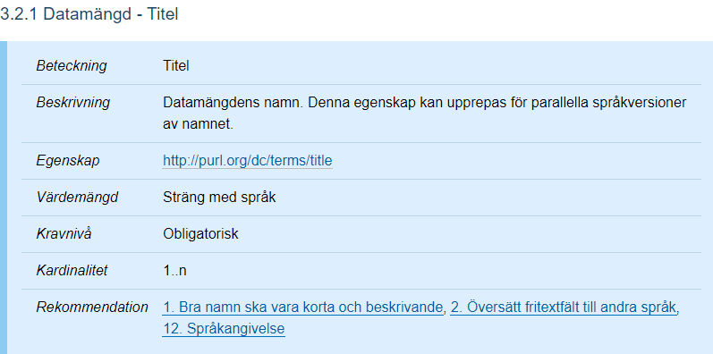
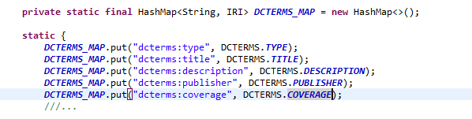
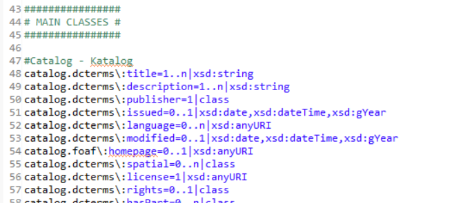
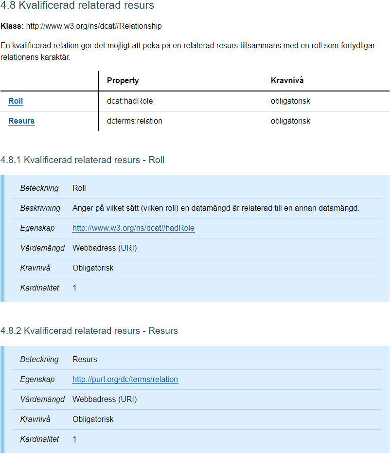
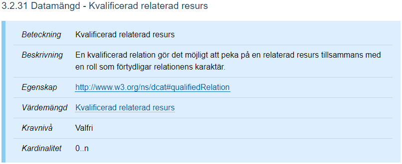

# Tutorial - Lägga till/ändra element i DCAT-fil

Nedan följer ett "kokboksrecept" på hur man ändrar eller lägger till data i den .RDF-fil som genereras av programmet.

För att ändra eller lägga till ett element i .RDF-filen kan det behövas en ändring i programkoden beroende på vilken typ av data som ska läggas till..

RDF-filen genereras utifrån DCAT-AP-SE specifikationen, som finns på
[Dataportalen DCAT specifikation](https://docs.dataportal.se/dcat/sv/#intro).
I denna tutorial kommer det finnas hänvisningar till denna specifikation och det är bra att studera den om något är oklart.

Element i DCAT-AP-SE kan vara av enkel eller komplex typ:

- En **enkel typ** innehåller ett enkelt värde, t.ex. en sträng, och länkar inte till någon stödjande klass.
  Exempel: [Datamängd - Titel](https://docs.dataportal.se/dcat/sv/#dcat_Dataset-dcterms_title).
- En **komplex typ** länkar från en klass till en stödjande klass, som i sin tur har ett eller flera underelement.
  Exempel: [Datamängd - Tidsperiod](https://docs.dataportal.se/dcat/sv/#dcat_Dataset-dcterms_temporal).

För att lägga till en enkel typ behöver man oftast inte ändra i programkoden vilket man måste göra om det är en komplex typ.

Guiden består av två delar. Först beskrivs de filer och klasser som styr vilka element applikationen
hanterar. Därefter följer två recept med stegen för att lägga till en enkel respektive en komplex typ.

## Filer och klasser

| Fil / klass | Roll | Berörs av |
|:---|:---|:---|
| Bundle-filen | Anger vilka element som är tillåtna, deras kardinalitet och värdetyp. | Enkel och komplex typ (läses, ändras inte) |
| Mappningsfilen | Kopplar namnen i API-definitionen till DCAT-properties. | Enkel och komplex typ |
| `DcatClass` | Kopplar applikationens klasser till deras definition i bundle-filen. | Komplex typ |
| `VocabularyStringToIRI` | Översätter prefix-namn till fullständiga IRI:er. | Enkel och komplex typ |
| `RDFWorker` | Bygger upp och skriver ut RDF-filen. | Komplex typ |

### Bundle-filen

Bundle-filen är den publicerade maskinläsbara versionen av DCAT-AP-SE. Den finns på
[diggsweden/DCAT-AP-SE/3.0.1](https://github.com/diggsweden/DCAT-AP-SE/tree/master/3.0.1).
Filen publiceras av DIGG och ska inte ändras lokalt. Om ett element saknas i bundle-filen stöds det inte av specifikationen och ska inte läggas till i applikationen.

Sökvägen till bundle-filen anges av propertyn `dcat.bundle-path` i `application.properties`
under `/src/main/resources/`.

#### Uppbyggnad

Bundle-filen består av en lista, `templates`, där varje post beskriver ett element och har ett unikt `id`.
Klasser är poster av typen `group`, med en lista `items` som anger vilka element som är tillåtna i klassen.
Varje post i `items` är en referens till ett annat `id` i filen.

Så här ser början av Datamängd ut:

```json
{
  "type": "group",
  "id": "dcat:Dataset",
  "label": { "en": "Dataset", "sv": "Datamängd" },
  "constraints": {
    "http://www.w3.org/1999/02/22-rdf-syntax-ns#type": "http://www.w3.org/ns/dcat#Dataset"
  },
  "items": [
    "dcat:dcterms:title_da",
    "dcat:dcterms:description_da",
    "dcat:dcterms:publisher_da",
    ...
  ]
}
```

#### Fälten i en template

| Fält | Betydelse |
|:---|:---|
| `id` | Unikt id för templaten. Används i `items`-listor och i `DcatClass`. |
| `property` | Propertyn som skrivs ut i RDF-filen. Prefixet (t.ex. `dcterms`) anger namnrymden. |
| `type` | `text` (fritext), `choice` (värde ur en lista eller en URI) eller `group` (komplex typ). |
| `nodetype` | Värdetypen, se nästa tabell. |
| `cardinality` | `min` och `max` anger hur många gånger elementet får förekomma. Saknas `max` är antalet obegränsat, och saknas hela fältet är elementet valfritt och obegränsat. `pref` är bara ett rekommenderat antal och påverkar inte vad som är tillåtet. |
| `pattern` | Reguljärt uttryck som värdet måste matcha. |
| `datatype` | Tillåtna datatyper för `DATATYPE_LITERAL`, t.ex. `xsd:date`. |
| `constraints` | För en komplex typ anger `rdf:type` vilken typ den stödjande klassen har. |
| `items` | För en komplex typ: referenser till underelementens templates. |
| `extends` | Ärver en gemensam definition från en annan template. `dcat:theme-da` ärver t.ex. listan med kategorier från `dcat:theme`. |

Vanliga värden för `nodetype`:

| nodetype | Betydelse |
|:---|:---|
| `LANGUAGE_LITERAL` | Sträng med språkangivelse, t.ex. en titel eller beskrivning. |
| `ONLY_LITERAL` | Sträng utan språkangivelse, t.ex. en identifierare. |
| `DATATYPE_LITERAL` | Värde med datatyp, se fältet `datatype`. |
| `URI` | En webbadress. |
| `RESOURCE` | En länk till en annan nod i filen, t.ex. en aktör eller en stödjande klass. |

#### Samma element i flera klasser

Samma property förekommer ofta i flera klasser, med ett eget `id` per klass. Titeln har t.ex.
`dcat:dcterms:title_ca` (Katalog), `dcat:dcterms:title_da` (Datamängd), `dcat:dcterms:title_di` (Distribution),
`dcat:dcterms:title_ds` (Datatjänst) och `dcat:dcterms:title_dss` (Datamängdsserie). Definitionen kan
skilja sig mellan klasserna: titeln är obligatorisk på Datamängd men valfri på Distribution.
Suffixen följer inte alltid samma mönster, så utgå alltid från klassens `items`-lista för att hitta rätt `id`.

### Mappningsfilen

Mappningsfilen kopplar namnen API-producenten använder i API-definitionen till DCAT-properties.
Element på katalognivå mappas i `to_catalog/convertmapToDcat.json`, övriga i `to_dcat/convertmapToDcat.json`.

Filen består av block på toppnivå, ett per klass. I varje block anger nyckeln vad som mappas och
`metadata` det namn som används i API-definitionen.

- För en **enkel typ** är nyckeln själva propertyn, t.ex. `dcterms:title`.
- För en **komplex typ** är nyckeln namnet på ett annat block på toppnivå t.ex.
`contactPoint` som beskriver den stödjande klassen.
  Ett sådant block kan återanvändas av flera klasser.

Ett element måste vara mappat för att applikationen ska kunna läsa in det, även om det finns i bundle-filen.

### DcatClass

Alla primära och stödjande klasser måste finnas i enumen `DcatClass`. Varje post har ett internt namn
och id:t på den template i bundle-filen som beskriver klassen:

```java
RELATIONSHIP("relationship", "dcat:qualifiedRelation"),
PERIODOFTIME("periodoftime", "dcat:dcterms:temporal_da"),
```

Via id:t hämtas klassens underelement, kardinalitet och typer. Det andra värdet måste därför
vara exakt samma som `id` i bundle-filen. Finns flera templates för samma klass, en per primärklass,
pekar enumen på en av dem.

### VocabularyStringToIRI

Alla properties som applikationen kan skriva ut finns i klassen `VocabularyStringToIRI`, grupperade per
namnrymd. Här översätts prefix-namnet (t.ex. `dcterms:title`) till den fullständiga IRI:n
(`http://purl.org/dc/terms/title`). Se bild 2.

  
Bild 2. Utdrag ur koden i VocabularyStringToIRI.

Om en ny version av DCAT-AP-SE inför en property som inte redan finns i klassen måste den läggas till.
Man kopierar då en befintlig rad i namnrymdens map och ändrar innehållet, se bild 3.

  
Bild 3. Ett nytt element läggs till i VocabularyStringToIRI.

### RDFWorker

Klassen `RDFWorker` bygger upp RDF-modellen och skriver ut den som RDF/XML. Varje primärklass
byggs i en egen metod, t.ex. `createDataset()` för Datamängd.

Enkla typer ligger i `DataClass.dcData` och läggs till automatiskt utifrån mappningen via:

```java
addToModel(model, dataSetIRI, dataSet.dcData)
```

Komplexa typer läggs till som egna noder
med metoden `addNodes()`:

```java
addNodes(dataSetIRI, DCAT.QUALIFIED_RELATION, DCAT.RELATIONSHIP, dataSet.qualifiedRelations);
```

Parametrarna är:

```text
dataSetIRI - Föräldranoden
```

```text
DCAT.QUALIFIED_RELATION – Elementtypen i Dataset(föräldranoden) som länkar till noden
```

```text
DCAT.RELATIONSHIP – Barn-nodens elemttyp relationship
```

```text
dataSet.qualifiedRelations – Lista med objekt där varje objekt innehåller data(dcat:hadRole och dcterms:relation) för en nod.
```

Om ett dataobjekt har ett `about`-värde används det som nodens URI, annars skapas en anonym nod.

## Recept 1: Lägga till en enkel typ

Exempel: `dcterms:title` på Datamängd.

**1. Kontrollera definitionen i bundle-filen.** Leta upp elementet i klassens `items`-lista,
här `dcat:dcterms:title_da`, och läs av templaten:

```json
{
  "id": "dcat:dcterms:title_da",
  "property": "dcterms:title",
  "type": "text",
  "nodetype": "LANGUAGE_LITERAL",
  "cardinality": { "min": 1, "pref": 0 }
}
```

Titeln är en sträng med språkangivelse, obligatorisk och får förekomma flera gånger, t.ex. en per språk.
Samma information finns i specifikationen, se bild 1.

  
Bild 1. Definition av dcterms:title i specifikationen.

**2. Lägg till mappningen.** Lägg in propertyn under rätt klass i mappningsfilen:

```json
"Dataset": {
    ...
    "dcterms:title": { "metadata": "title" }
}
```

**3. Kontrollera VocabularyStringToIRI.** Kontrollera att `dcterms:title` finns i klassen, och lägg till den om den saknas.

## Recept 2: Lägga till en komplex typ

Exempel: `dcat:qualifiedRelation` på Datamängd. Elementet länkar till klassen
[dcat:Relationship](http://www.w3.org/ns/dcat#Relationship), som har underelementen `dcat:hadRole` och `dcterms:relation`.

  
Bild 4. Kvalificerad relaterad resurs i specifikationen.

**1. Kontrollera definitionen i bundle-filen.** En komplex typ känns igen på `"type": "group"`:

```json
{
  "id": "dcat:qualifiedRelation",
  "property": "dcat:qualifiedRelation",
  "type": "group",
  "nodetype": "RESOURCE",
  "constraints": { "rdf:type": ["dcat:Relationship"] },
  "items": ["dcat:hadRole", "dcat:QRResource"]
}
```

`property` är länken från Datamängd, och `constraints` → `rdf:type` är typen på den nya noden.
Templaten saknar `cardinality`, så elementet är valfritt och får förekomma obegränsat antal gånger.
Läs sedan av underelementen i `items`. Här är båda obligatoriska (`min: 1, max: 1`) och ska vara
URI:er som matchar respektive `pattern`.

**2. Lägg till mappningen.** En komplex typ mappas i två delar: en referens i den primära klassen
och ett eget block för den stödjande klassen:

```json
"Dataset": {
    ...
    "qualifiedRelation": { "metadata": "qualifiedRelation" }
},
"qualifiedRelation": {
    "metadata": "qualifiedRelation",
    "dcat:hadRole": { "metadata": "role" },
    "dcterms:relation": { "metadata": "relation" }
}
```

Blocket `qualifiedRelation` används även av `DatasetSeries`.

**3. Lägg till klassen i DcatClass.** Det andra värdet är template-id:t från steg 1:

```java
RELATIONSHIP("relationship", "dcat:qualifiedRelation"),
```

**4. Kontrollera VocabularyStringToIRI.** Alla ingående properties, här `dcat:qualifiedRelation`,
`dcat:hadRole` och `dcterms:relation`, måste finnas. Saknas t.ex. `dcat:qualifiedRelation` läggs den till i `DCAT_MAP`:

```java
DCAT_MAP.put("dcat:qualifiedRelation", DCAT.QUALIFIED_RELATION);
```

**5. Skapa noden i RDFWorker.** Lägg till ett anrop till `addNodes()` i `createDataset()`:

```java
addNodes(dataSetIRI, DCAT.QUALIFIED_RELATION, DCAT.RELATIONSHIP, dataSet.qualifiedRelations);
```

Används typen i flera klasser behöver anropet läggas in i varje klass metod, t.ex. även för Datamängdsserie.

**Resultat.** Bild 5 visar hur den kvalificerade relationen ser ut i den genererade RDF-filen.
Datamängden har elementet `dcat:qualifiedRelation`, som innehåller en nod av typen `dcat:Relationship`
med de två underelementen `dcat:hadRole` och `dcterms:relation`.


Bild 5. Utdrag ur den resulterande RDF-filen.
